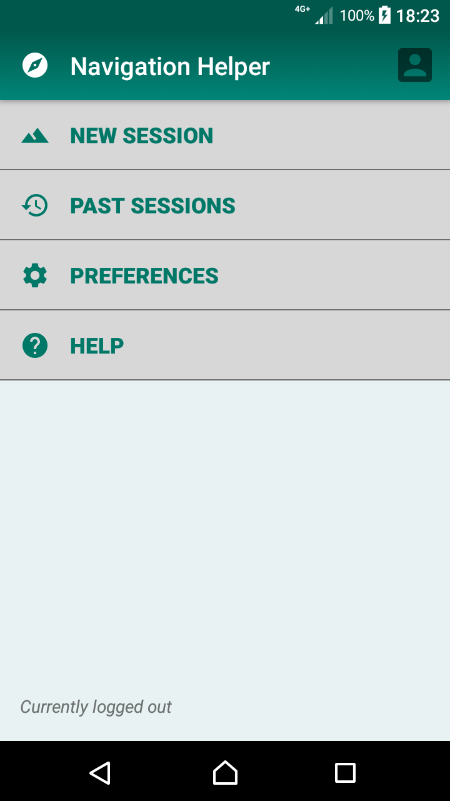
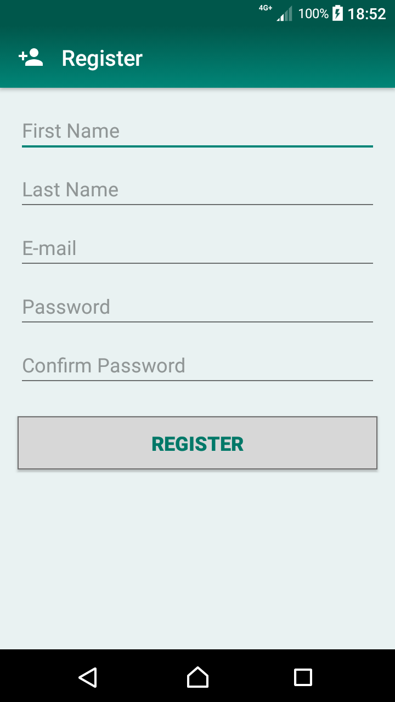
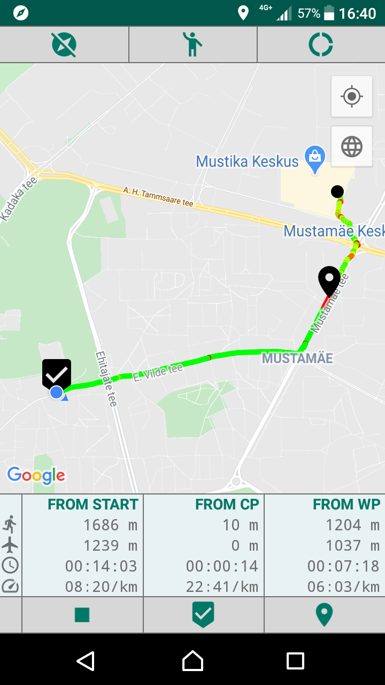
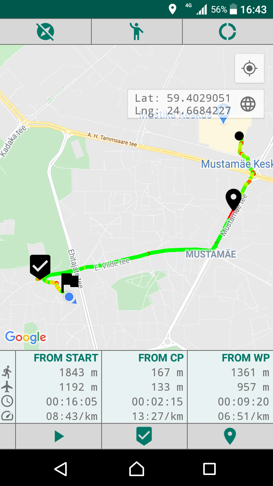
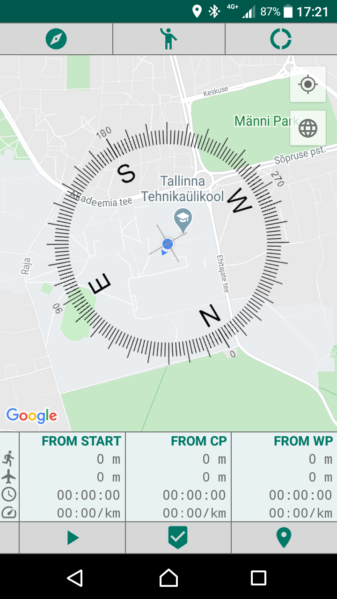

# Navigation Helper

Navigation Helper is an application designed to help with navigation in unknown terrains. This is done by tracking the location of the device, displaying it on map and allowing the user to set map markers (checkpoints and waypoints) along the way, from which the travelled and direct distances to their current location are displayed, making it possible to triangulate locations. The app can also be used to keep track of your progress in orienteering or sporting competitions and training, as it displays the time elapsed and the average pace from the map markers.

## Features:
  * Draw track based on movement
  * Add map markers (checkpoints & waypoints)
  * Display direct & travelled distance, time elapsed and pace from map markers to current location
  * Rotation support for UI
 

| Simple navigation menu | Register & log in | Add map markers | View coordinates | Toggle compass |
|-------------------|-------------------|-------------------|-------------------|-------------------|
|  |  |  |  |  |
