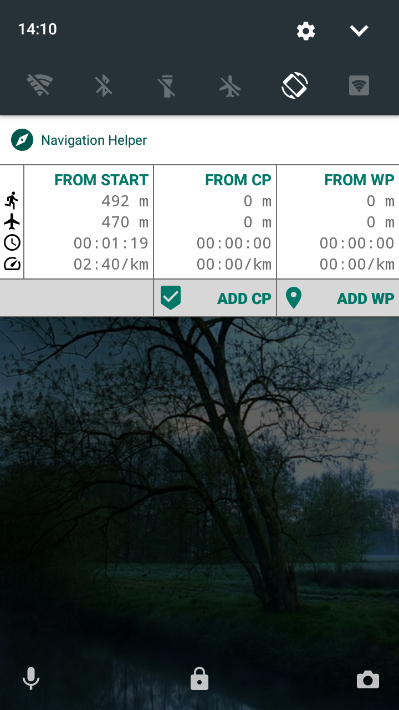
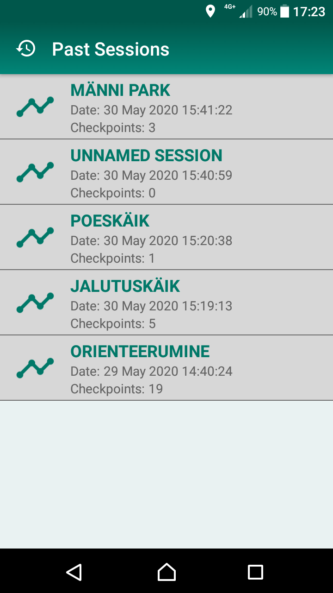
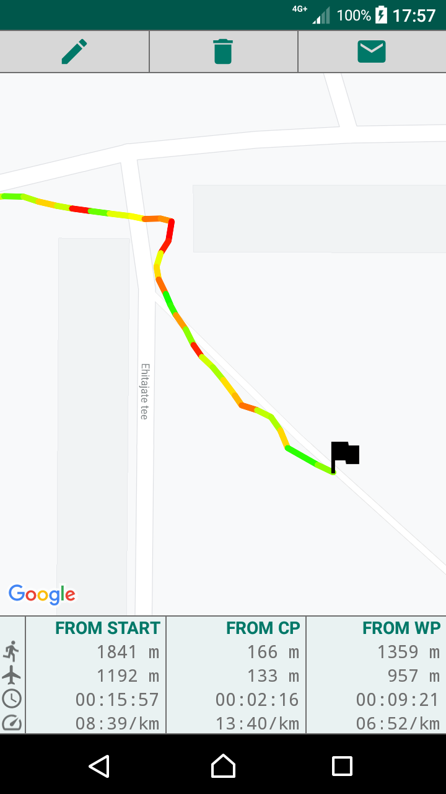
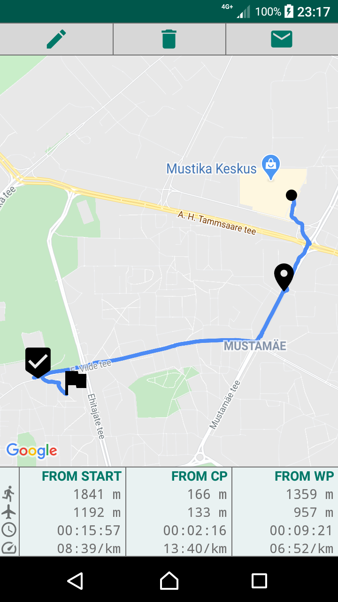
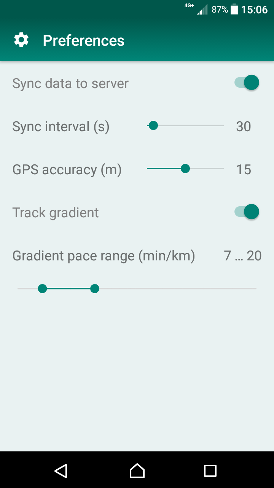

# Navigation Helper

Navigation Helper is an application designed to help with navigation in unknown terrains. This is done by tracking the location of the device, displaying it on map and allowing the user to set map markers (checkpoints and waypoints) along the way, from which the travelled and direct distances to their current location are displayed, making it possible to triangulate locations. The app can also be used to keep track of your progress in orienteering or sporting competitions and training, as it displays the time elapsed and the average pace from the map markers.

## Features:
  * Toggle compass, map orientation & location centering
  * View real-time coordinates
  * Draw track based on movement & color based on pace
  * Add map markers (checkpoints & waypoints)
  * Display direct & travelled distance, time elapsed & pace from map markers to current location
  * Show static notification to allow viewing session data and adding map markers from lock-screen
  * Save sessions locally to view/rename/delete/export later
  * Register, log in & sync sessions to sportmap.akaver.com in real-time, allowing others to monitor your progress
  * Manage syncing, track coloring & GPS preferences
 

| Simple menu | Register & log in | Add map markers | View coordinates | Toggle compass |
|:-----------:|:-----------------:|:---------------:|:----------------:|:--------------:|
|  |  |  |  |  |

| Static notification | Browse history | Zoom into track | Toggle coloring | Manage settings |
|:-------------------:|:--------------:|:---------------:|:---------------:|:---------------:|
|  |  |  |  |  |

